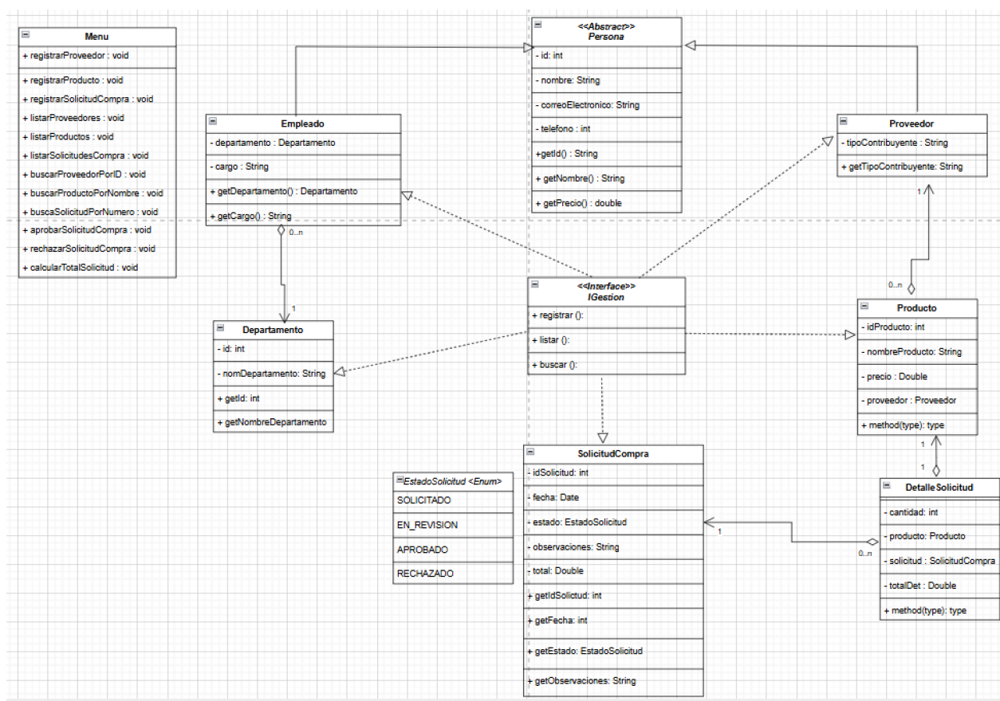

# Programación Orientada en Objetos

## 📌 Información General

- **Título:**  Diseño y Desarrollo de una aplicación orientada a objetos utilizando Java.
- **Carrera:** Computación
- **Estudiantes:** Diana Borja y Keyra Carvajal
- **Fecha:** 28/04/2025
- **Profesor:** PhD. Gabriel Alejandro León Paredes

---

## 🛠️ Descripción

Este proyecto consiste en un sistema de gestión de compras desarrollado en Java, donde el usuario puede registrar proveedores, productos y solicitudes de compra. A través de un menú interactivo en consola, se permite realizar operaciones como registrar, listar datos, buscar proveedores y productos, aprobar o rechazar solicitudes, y gestionar la información de manera organizada. El sistema aplica principios de programación orientada a objetos (POO) como herencia, encapsulamiento e interfaces. Además, se diseñó un diagrama UML utilizando la herramienta Draw.io, donde se representaron las entidades principales y sus relaciones. El desarrollo del proyecto permitió fortalecer habilidades en el modelado de sistemas, la estructura de programas en Java y el manejo de listas dinámicas para la gestión de datos.

---

# 💻 Tecnologías Utilizadas
- Java 24

- IntelliJ IDEA

- Programación Orientada a Objetos (POO)

- Estructuras de control (for, do-while, switch)

- Listas dinámicas (ArrayList)

---

## 🧩 Diagrama UML
El diseño de las clases y relaciones fue realizado mediante un diagrama UML en Draw.io, representando las entidades Proveedor, Producto, SolicitudCompra, DetalleSolicitud, Empleado y Departamento, así como su herencia desde Persona.

---

## 🚀 Ejecución

Para ejecutar el proyecto en IntelliJ IDEA:

1. Abre el proyecto en IntelliJ IDEA.

2. Asegúrate de que el archivo Main.java esté configurado como clase principal.

3. Haz clic derecho sobre Main.java y selecciona Run 'Main.main()', o utiliza el botón verde ▶️ en la parte superior.

4. El programa se compilará y ejecutará automáticamente, mostrando el menú de opciones en la consola.

---

## 🧑‍💻 Ejemplo de Entrada

Al ejecutar el programa, se mostrará el siguiente menú en la consola:

=== MENÚ PRINCIPAL ===
1. Registrar Proveedor
2. Registrar Producto
3. Registrar Solicitud de Compra
4. Listar Proveedores
5. Listar Productos
6. Listar Solicitudes de Compra
7. Buscar Proveedor por ID
8. Buscar Producto por Nombre
9. Buscar Solicitud por Número
10. Aprobar Solicitud de Compra
11. Rechazar Solicitud de Compra
12. Calcular Total de Solicitud
0. Salir
   Seleccione una opción:

Por ejemplo:

- Si el usuario ingresa 1, el sistema pedirá los datos para registrar un nuevo proveedor.

- Si el usuario ingresa 5, el sistema listará todos los productos registrados.

- Si el usuario ingresa 10, podrá aprobar una solicitud de compra ya existente.

- El programa continuará mostrando el menú hasta que el usuario elija la opción 0 para salir.
